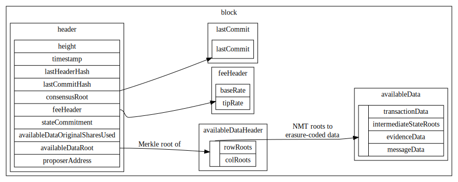

Architecture
===

- [Architecture](#architecture)
- [Common Terms and Expressions](#common-terms-and-expressions)
- [System Architecture](#system-architecture)

# Common Terms and Expressions

| name              | description                                                                                                                                                                      |
| ----------------- | -------------------------------------------------------------------------------------------------------------------------------------------------------------------------------- |
| App (application) | Alternate name for "[virtual sidechain](https://arxiv.org/abs/1905.09274)." LazyLedger apps are sidechains that post all their data onto the LazyLedger chain to share security. |
| Transaction       | Requests that modify the consensus-critical state (validator balances and statuses).                                                                                             |
| Message           | Requests that are executed by non-consensus-critical apps.                                                                                                                       |

# System Architecture

LazyLedger has a minimal state: the validator set (account balances, validator status, etc.). Changes to the validator set are done with native _transactions_, distinct from the _messages_ processed by apps. Transactions are signed and must be processed by clients to determine the validator set, while messages are un-signed data blobs that will usually represent an app's block data.

Transactions pay fees similarly to how they would in a normal blockchain (e.g. Bitcoin), and their side effects are restricted to modifying the validator set and their balances. Transactions can additionally pay fees for the inclusion of a message (identified by a hash) in the same block. The validator set is committed to in the block header, and since the entire system state _is_ the validator set, this is the only state commitment needed in the header.

One dideratum that will most likely be included is burning a non-proportional amount of coins for each transaction as a network fee. This provides baseline demand for the native coin: as the chain is used more, more coins must be bought then burned to pay for fees.

This architecture has the benefit of allowing a spectrum of clients. Since different components are made available through commitments, client that are only interested in a portion of the block data do not need to download and process the whole block.

Non-consensus full clients have easy and direct access to all the data they need to validate: the transactions. Messages do not need to be validated, as they do not change the state, they simply need to be verified as available.

Light clients are almost identical to full clients here: they simply need to process all the validator set changes (i.e. transactions) and run data availability checks on the rest of the block. Unlike full clients, light clients do not need to verify the signatures of transactions and can instead trust the majority of validators to sign off on validator set changes, with the addition of fraud proofs in case of an invalid signature.
